# Async configuration for FastAPI and SQLModel

This is a project template which uses [FastAPI](https://fastapi.tiangolo.com/), [Alembic](https://alembic.sqlalchemy.org/en/latest/) and async [SQLModel](https://sqlmodel.tiangolo.com/) as ORM which already is compatible with [Pydantic V2](https://docs.pydantic.dev/2.5/) and [SQLAlchemy V2.0](https://docs.sqlalchemy.org/en/20/). It shows a complete async CRUD template using authentication. Our implementation utilizes the newest version of FastAPI and incorporates typing hints that are fully compatible with **Python >=3.10**. If you're looking to build modern and efficient web applications with Python, this template will provide you with the necessary tools to get started quickly. You can read a short article with the motivations of starting this project in [Our Journey Using Async FastAPI](https://medium.com/allient/our-journey-using-async-fastapi-to-harnessing-the-power-of-modern-web-apis-90301827f14c?source=friends_link&sk=9006b3f2a4137a28a8576a69546c8c18). 

If you are looking to create new a project from zero, I recommend you to use [create-fastapi-project](https://github.com/allient/create-fastapi-project). 

Do you need assistance, trainning or support for your newxt project using fastapi?. Please don't hesitate to get in touch with our team at [info@allient.io](mailto:info@allient.io) or schedule a meeting with us [here](https://calendly.com/jonathanvargas).


## Table of Contents
1. [Prerequisites](#prerequisites)
2. [Run the project using Docker containers and forcing build containers](#run-the-project-using-docker-containers-and-forcing-build-containers)
3. [Run project using Docker containers](#run-project-using-docker-containers)
4. [Setup database with initial data](#setup-database-with-initial-data)
5. [ERD Database model](#erd-database-model)
6. [Containers architecture](#containers-architecture)
7. [Preview](#preview)
8. [Static files](#static-files)
9. [Minio server](#minio-server)
10. [Celery](#celery)
11. [Run Alembic migrations (Only if you change the DB model)](#run-alembic-migrations-only-if-you-change-the-db-model)
12. [Production Deployment](#production-deployment)
13. [Database unique IDs](#database-unique-ids)
14. [Code Style](#code-style)
15. [SonarQube static analysis](#sonarqube-static-analysis)
16. [Testing](#testing)
17. [Type checker](#type-checker)
18. [IP and Source Code Protection](#ip-and-source-code-protection)

# Prerequisites

## Set environment variables

Create an **.env** file on root folder and copy the content from **.env.example**. Feel free to change it according to your own configuration.

## Docker engine
This project utilizes Docker and Docker Compose, so please ensure that you have installed the latest version compatible with your operating system. If you haven't already installed Docker, you can find detailed instructions on how to do so [here](https://docs.docker.com/engine/install/). Docker desktop can be good for a dev computer.

You can check if it is installed with this command
```
docker --version
```

## Make
"Make" is a build automation tool that is primarily used to manage the compilation and building of software projects. It reads a file called a "Makefile" which specifies a set of rules and dependencies for building a project, and then executes the necessary commands to build the project according to those rules. Depending of your OS you will requiere to install it in different ways.

Mac
```
xcode-select --install
```

Ubuntu
```
sudo apt-get install build-essential
sudo apt-get -y install make
```

Windows
```
Download chocolatey
https://chocolatey.org/install

You can check if it is installed with this command
```
choco -v
```
make install
choco install make
```
You can check if it is installed with this command
```
make --version
```

## Python ">3.9,<3.12"
If you haven't already installed Python. You can download and install python from [here](https://www.python.org/downloads/). 

You can check yu python version:
```
python --version
```

## Poetry

Python Poetry is a tool for dependency management and packaging in Python. It provides a modern and efficient approach to managing Python projects' dependencies, virtual environments, and packaging. You can find detailed instructions on how install it [here](https://python-poetry.org/docs/#installing-with-the-official-installer). Poetry manages packages in **pyproject.toml** file; In this project you can find it in the folder backend/app.


Windows
```
open windows powershell

(Invoke-WebRequest -Uri https://install.python-poetry.org -UseBasicParsing).Content | python - --version 1.8.3

You can check if it is installed with this command
```
poetry --version
```

### Dev tip to activate virtual environment
When you are opening python files do this cna help you to vscode detect installed packages. 

```
cd backend/app/
poetry shell
```

After that you can show the interpreted path. You can copy that path and set as the default for the project in vscode. Press on **Enter interpreter path ..** and past path.

<p align="center">
  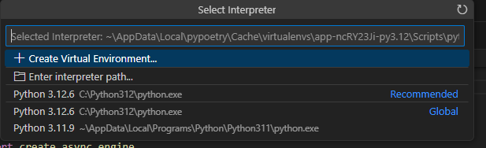
</p>


## Run the project using Docker containers and forcing build containers

*Using docker compose command*
```sh
docker compose -f docker-compose-dev.yml up --build
```

*Using Makefile command*
```sh
make run-dev-build
```

## Run project using Docker containers

*Using docker compose command*
```sh
docker compose -f docker-compose-dev.yml up
```

*Using Makefile command*
```sh
make run-dev
```

## Setup database with initial data
This creates sample users on database.

*Using docker compose command*
```
docker compose -f docker-compose-dev.yml exec fastapi_server python app/initial_data.py
```

*Using Makefile command*
```sh
make init-db
```

You can connect to the Database using pgAdmin4 and use the credentials from .env file. Database port on local machine has been configured to **5454** on docker-compose-dev.yml file

(Optional) If you prefer you can run pgAdmin4 on a docker container using the following commands, they should executed on different terminals:

*Starts pgadmin*
```sh
make run-pgadmin
```

This starts pgamin in [http://localhost:15432](http://localhost:15432). When connecting to db server introduce the password by default it is **postgres** if you didn't change it in .env file.

<p align="center">
  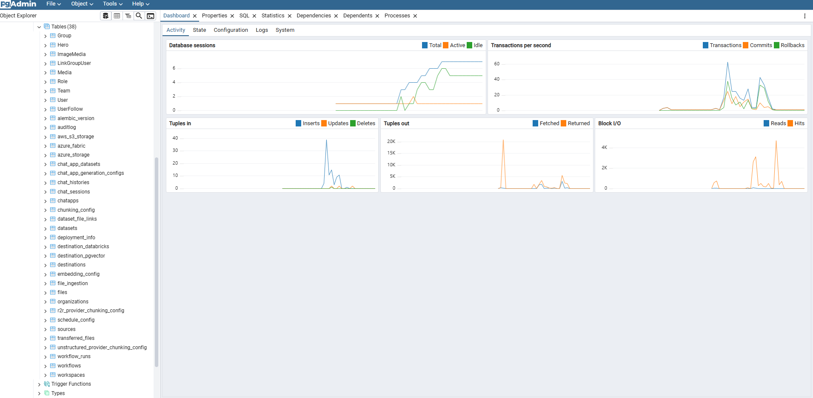
</p>

## ERD Database model
<p align="center">
  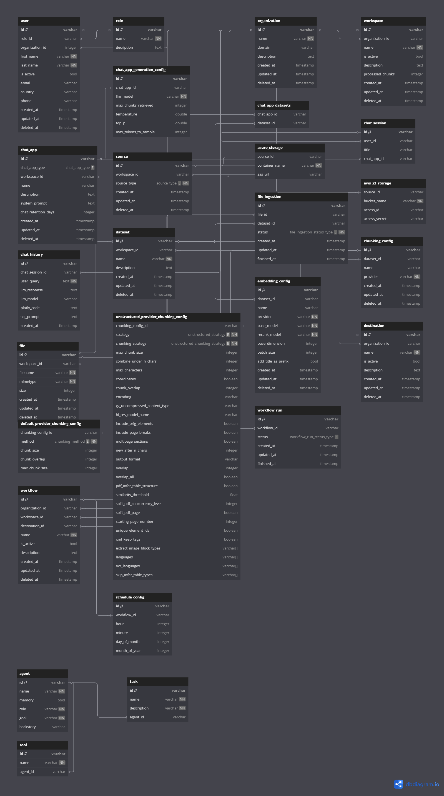
</p>

## Containers architecture -->
<p align="center">
  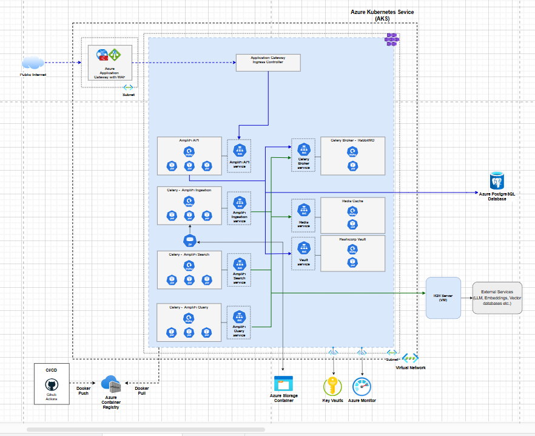
</p>

As this project uses [Caddy](https://caddyserver.com/) as a reverse proxy, which uses namespaces routing, you can access the documentation with the following path [http://localhost:8085/docs#](http://localhost:8085/docs#)

## Preview
  
<p align="center">
  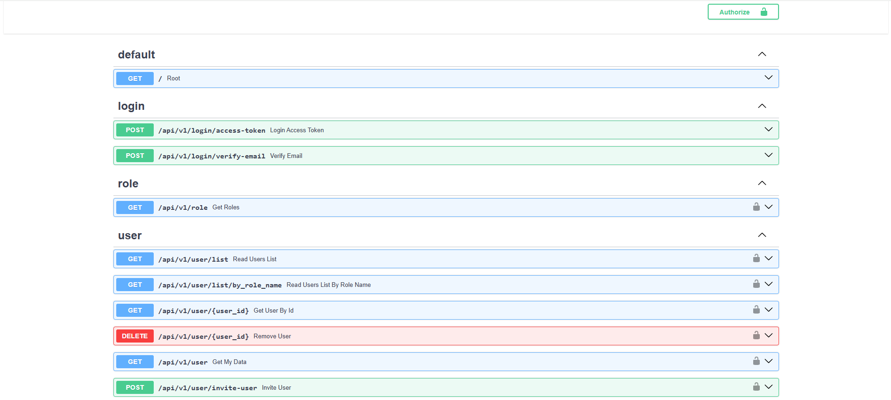
</p>
<p align="center">
  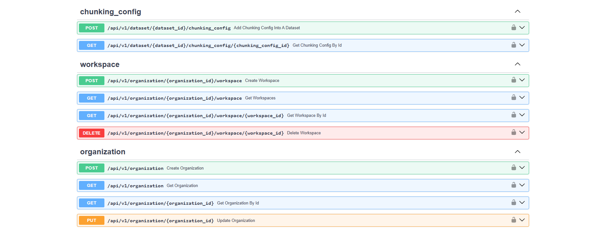
</p>
<p align="center">
  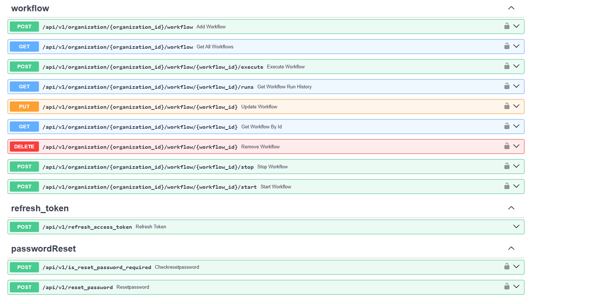
</p>
<p align="center">
  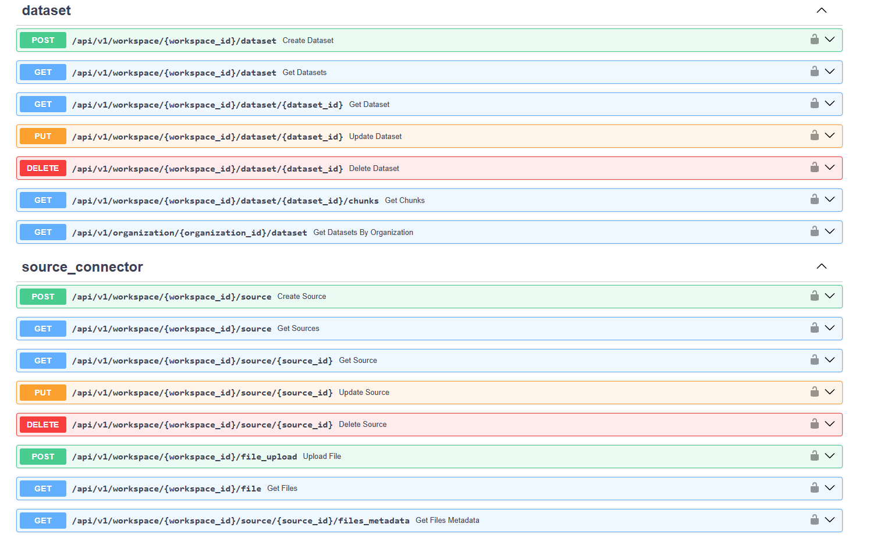
</p>
<p align="center">
  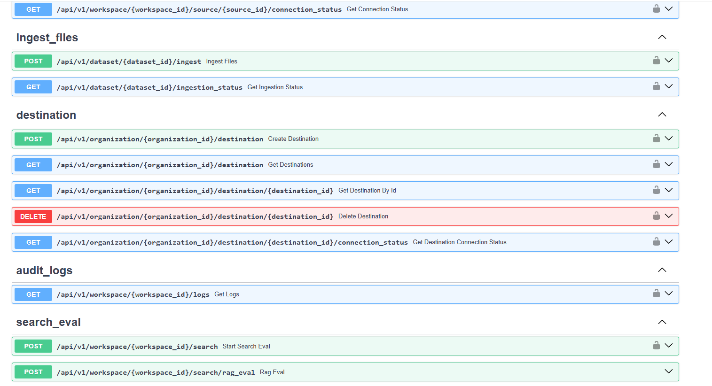
</p>

 ## Celery
[Celery](https://docs.celeryq.dev/en/stable/getting-started/introduction.html) is a distributed task queue that allows developers to run asynchronous tasks in their applications. It is particularly useful for tasks that are time-consuming, require heavy computation or access external services, and can be run independently of the main application. It also offers features such as task scheduling, task prioritization, and retries in case of failure.

[Celery Beat](https://docs.celeryq.dev/en/stable/userguide/periodic-tasks.html) is an additional component of Celery that allows developers to schedule periodic tasks and intervals for their Celery workers. It provides an easy-to-use interface for defining task schedules and supports several scheduling options such as crontab, interval, and relative.

You can see the architecture used in this project which uses Redis as celery broker and the current postgres database as celery backend. It also uses [celery-sqlalchemy-scheduler](https://github.com/AngelLiang/celery-sqlalchemy-scheduler) to store celery beats task into database so they can mutated.

Within the **natural_language** endpoints, you can access a sample application that demonstrates not only synchronous prediction of machine learning models but also batch prediction. Additionally, there are examples of how to schedule periodic tasks using Celery Beat in the **periodic_tasks** endpoints.


<p align="center">
  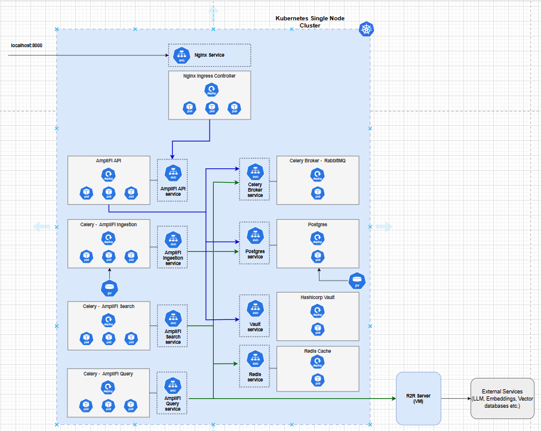
</p>


## Run Alembic migrations (Only if you change the DB model)

*Using docker compose command*
```sh
docker compose -f docker-compose-dev.yml exec fastapi_server alembic revision --autogenerate
docker compose -f docker-compose-dev.yml exec fastapi_server alembic upgrade head
```

*Using Makefile command*
```sh
make add-dev-migration
```

## Production Deployment
Remember to use a persistant PostgreSQL database, update the new credentials on .env file and use this command to run the project in a production environment. For testing this configuration on localhost you can uncomment the database container and 
depends_on of fastapi container otherwise it will not work on a local environment.

*Using docker compose command*
```sh
docker compose up --build
```

## Database unique IDs
Generating and using unique IDs is a really important desicion when starting a new project and its most common use is as primary keys for database tables. This project uses a custom [UUID7 Draft04 implementation](https://github.com/oittaa/uuid6-python) to make it simple to use and take advantage of UUID type of PostgreSQL. UUID7 combines timestamp with random data in order to help to convert data into time-stamped sequencially. If you are looking for another alternatives for tables IDs like [Snowflakes](https://betterprogramming.pub/uuid-generation-snowflake-identifiers-unique-2aed8b1771bc), [ULID](https://github.com/ulid/spec), [KSUID](https://github.com/segmentio/ksuid), [pushID](https://firebase.blog/posts/2015/02/the-2120-ways-to-ensure-unique_68#how-push-ids-are-generated), [xid](https://github.com/rs/xid) among others you can check [these references](https://github.com/jonra1993/fastapi-alembic-sqlmodel-async/issues/12#issuecomment-1272425109).


## Code Style
[](https://github.com/psf/black)

To ensure a standardized code style this project uses [black](https://github.com/ambv/black) and [ruff](https://github.com/charliermarsh/ruff). If you want to change the config rules you can edit both ruff and  black rules in the  *pyproject.toml* file.

To reformat files execute the following command
```sh
make formatter
```

To run lint, you can run the following command:
```sh
make lint
```

To run lint in watch mode, you can run the following command:
```sh
make lint-watch
```

To run lint and try to fix the errors, you can run the following command:
```sh
make lint-fix
```

## HLD_VIEW Amplifi
<p align="center">
  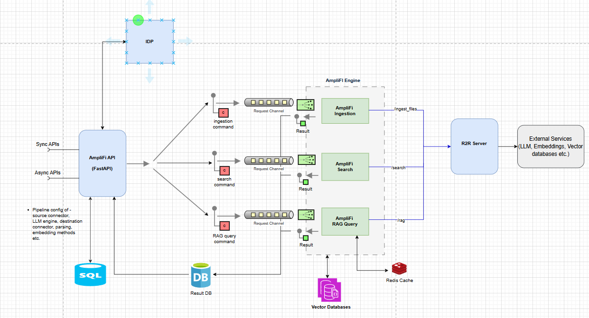
</p>

## Testing
Testing in FastAPI with pytest involves creating test functions that simulate HTTP requests to the API endpoints and verifying the responses. This approach allows us to conduct both unit tests for individual functions and integration tests for the entire application.

To perform tests in this project, we utilize two essential libraries: [pytest](https://github.com/pytest-dev/pytest) and [pytest-asyncio](https://github.com/pytest-dev/pytest-asyncio).

However, when testing FastAPI endpoints that utilize async connections with the database and a pool strategy, there is a trick to be aware of. The recommended approach is to create an isolated testing environment that connects to the database using the "poolclass": NullPool parameter on the engine. This helps to avoid potential issues related to tasks being attached to different loops. For more details on this, you can refer to the following references: [Fastapi testing RuntimeError: Task attached to a different loop](https://stackoverflow.com/questions/75252097/fastapi-testing-runtimeerror-task-attached-to-a-different-loop/75444607#75444607) and [Connection Pooling](https://docs.sqlalchemy.org/en/20/core/pooling.html#api-documentation-available-pool-implementations).


To execute the tests, follow these steps:


1. Start the testing environment using the command:

```sh
make run-test
```
2. Once the testing environment is up and running, open another terminal and run the tests with the following command:

```sh
make pytest
```

## Type checker
Python's type hints, introduced in PEP 484 and fully embraced in later versions of Python, allow you to specify the expected types of variables, function parameters, and return values. It is really good how fastapi documentation promotes type hints so this code base tryies to use this tool the most posible because type hints make the code more self-documenting by providing clear information about what types of values a function or variable can hold and they catch type-related errors at compile time, before the code is executed.

This project uses [mypy](https://mypy-lang.org/) a popular static type checker for Python. If you want to change the config rules you can edit the rules in the  *pyproject.toml* file.

To execute Type checking, run this command:

```sh
make mypy
```

## IP and Source Code Protection

Protecting source code is critical in Python-based projects due to its interpreted and easily decompiled nature. After evaluating several tools, **PyArmor** emerged as the most effective solution for securing our IP.

### ✅ Key Reasons:

* **Advanced Obfuscation**: Obscures Python bytecode to prevent reverse engineering, while maintaining full runtime compatibility.
* **License Enforcement**: Enables hardware-locked, time-limited, and domain-bound licenses for commercial distribution.
* **CI/CD Integration**: Offers a dedicated **CI license**—ideal for GitHub Actions, GitLab CI, etc.
* **Cross-Platform Support**: Works across Linux, Windows, macOS, and ARM devices.
* **Lightweight and Actively Maintained**: Easy to integrate, regularly updated, and enterprise-ready.

> 🛜 **Requirements**: Internet connection and PyArmor **9.0+**

### 🔧 Step 1: Install or Update PyArmor

```bash
pip install -U pyarmor
pyarmor -v
```

---

### 📥 Step 2: Download Registration Code

1. Download the **attachment** from license email.
2. Save it as:

```text
pyarmor-regcode-8075.txt
```

---

### 📝 Step 3: Register the License

> Replace `XXX` with either your **product name**. It should be 'amplifi'.

```bash
pyarmor reg -p XXX pyarmor-regcode-8075.txt
```

- If successful, the file `pyarmor-regfile-8075.zip` will be generated in the current directory.

---

### ⚠️ Important Notes

- 🔐 **Backup** `pyarmor-regcode-8075.txt`, but **do NOT use it repeatedly** for registration.
- 💾 **Backup** `pyarmor-regfile-8075.zip` — use this file for **all future registrations**.
- 🐳 **Do NOT use** `pyarmor-regfile-8075.zip` inside **Docker containers** or **CI/CD pipelines**.
- 🚫 **No "Lost and Found"** service is provided for missing files.

---

#### 🤖 CI/CD License Activation

- The CI License **only works in CI/CD pipelines**.
- Use `pyarmor-regfile-8075.zip` to **request a CI regfile** (this does **not** register PyArmor locally).

#### 📤 Request a CI Regfile

```bash
pyarmor reg -C pyarmor-regfile-8075.zip
```

- This will generate `pyarmor-ci-8075.zip`.

#### 🔍 Verify CI License Info (Local Machine)

```bash
pyarmor --home temp reg pyarmor-ci-8075.zip
```


### **Step 4: 🔐 Using PyArmor CI License in GitHub Actions**

To use your PyArmor CI license (`pyarmor-ci-8075.zip`) in GitHub Actions:

On your local machine, run:

```bash
base64 -w 0 pyarmor-ci-8075.zip > pyarmor-ci-8075.b64
```

* `-w 0` ensures the encoded output is in a single line (important for GitHub Secrets).
* The output will be saved in `pyarmor-ci-8075.b64`.

---

### **Step 5: Add as GitHub Secret**

1. Go to your **GitHub repository** > **Settings** > **Secrets and variables** > **Actions**.
2. Click **"New repository secret"**.
3. Name the secret:

   ```
   PYARMOR_CI_LICENSE
   ```
4. Paste the contents of `pyarmor-ci-8075.b64` as the **secret value**.
5. Save.

---
