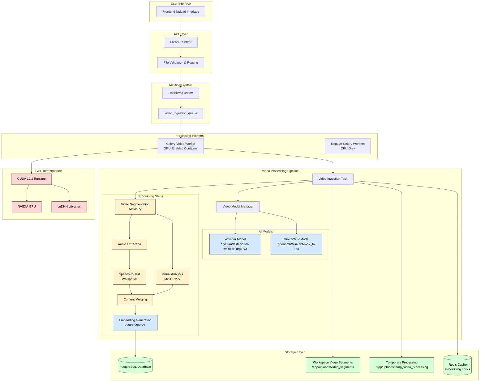
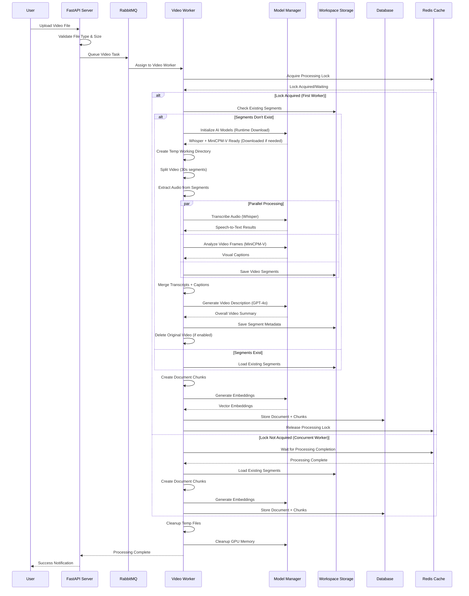

# 🎥 Video Ingestion Architecture & Process Flow

## Overview

The Amplifi Video Ingestion system provides comprehensive video processing capabilities through AI-powered transcription and captioning. This document explains the architecture, process flow, and technical implementation details.

## 🏗️ System Architecture



## 🔄 Detailed Process Flow



## 🧩 Component Details

### 1. File Upload & Validation
- **Supported Formats**: MP4, AVI, MOV, WMV, FLV, WebM, MKV
- **Size Limit**: 50MB (configurable via `MAX_VIDEO_SIZE_UPLOADED_FILES`)
- **MIME Type Validation**: Comprehensive validation with fallback to extension checking
- **Feature Flag**: Controlled by `ENABLE_VIDEO_INGESTION` environment variable

### 2. Video Segmentation
- **Segment Length**: 30 seconds (configurable via `VIDEO_SEGMENT_LENGTH`)
- **Frame Sampling**: 5 frames per segment (configurable via `VIDEO_FRAMES_PER_SEGMENT`)
- **Audio Extraction**: MP3 format (configurable via `VIDEO_AUDIO_FORMAT`)
- **Video Output**: MP4 format (configurable via `VIDEO_OUTPUT_FORMAT`)
- **Smart Merging**: Segments < 5 seconds are merged with previous segment

### 3. AI Processing Pipeline

#### Model Download Strategy
**Smart Build-Time and Runtime Approach**: Intelligent model handling based on environment detection.

**Build-Time Behavior**:
- ✅ **GPU Available** (local/production): Downloads models during build for immediate availability
- ✅ **No GPU** (CI/CD): Skips model downloads, installs CPU-compatible dependencies
- ✅ **Automatic Detection**: Uses `nvidia-smi` to detect GPU availability during build
- ✅ **Fallback Handling**: Gracefully handles both GPU and non-GPU build environments

**Runtime Behavior**:
- ✅ **CUDA Detection**: Automatically uses quantized models when GPU is available
- ✅ **CPU Fallback**: Falls back to non-quantized models when CUDA is unavailable
- ✅ **Model Downloads**: Downloads missing models automatically when first needed
- ✅ **Cache Persistence**: Models persist across container restarts when properly mounted

**Process Flow**:
1. **Build Time**: Models downloaded if GPU detected, skipped if not
2. **Runtime**: Missing models download automatically (5-10 minutes first time)
3. **Subsequent Runs**: Models load from cache (`~/.cache/huggingface/`)

#### Transcription (Whisper)
- **Model**: `Systran/faster-distil-whisper-large-v3`
- **Download**: Build-time (if GPU available) or runtime (if needed)
- **Device**: CUDA GPU with automatic CPU fallback
- **Parallel Processing**: Up to 3 concurrent workers (configurable)
- **Output**: Time-stamped speech-to-text transcripts

#### Visual Captioning (MiniCPM-V)
- **Model**: `openbmb/MiniCPM-V-2_6-int4` (GPU) or `openbmb/MiniCPM-V-2_6` (CPU fallback)
- **Revision**: `06219bd` (pinned for stability when using quantized version)
- **Download**: Build-time (if GPU available) or runtime (if needed)
- **Quantization**: 4-bit quantization when CUDA available, full precision fallback for CPU
- **Batch Processing**: 3 segments per batch (configurable)
- **Output**: Intelligent frame descriptions and visual context
- **Smart Loading**: Automatically selects appropriate model version based on CUDA availability

#### Description Generation
- **Model**: Azure OpenAI GPT-4o
- **Input**: First 10 segments (transcripts + captions)
- **Output**: Comprehensive video summary for search/categorization
- **Embedding**: Generated using `text-embedding-3-large`

### 4. Workspace-Level Architecture

#### Segment Storage Strategy
```
/app/uploads/video_segments/
├── {workspace_id}/
│   └── {file_id}/
│       ├── segment_0001.mp4
│       ├── segment_0002.mp4
│       ├── ...
│       └── segments_metadata.json
```

#### Benefits
- **Deduplication**: Same video processed once per workspace
- **Concurrent Safety**: Redis-based locking prevents duplicate processing
- **Resource Efficiency**: Multiple datasets can reuse same segments
- **Storage Optimization**: Original videos deleted after segmentation (optional)
- **Smart Cleanup**: Automatic cleanup of orphaned segments with reference tracking

### 5. Database Schema

#### Document Model
```sql
documents:
- id (UUID, Primary Key)
- file_id (UUID, Foreign Key)
- dataset_id (UUID, Foreign Key)
- document_type (ENUM: Video)
- processing_status (ENUM: Processing/Success/Failed/Exception)
- description (TEXT) -- AI-generated video summary
- description_embedding (VECTOR) -- Embedding for semantic search
- document_metadata (JSONB) -- Video metadata
```

#### Document Chunks Model
```sql
document_chunks:
- id (UUID, Primary Key)
- document_id (UUID, Foreign Key)
- chunk_text (TEXT) -- "Caption: ... Transcript: ..."
- chunk_embedding (VECTOR) -- Segment embedding
- chunk_type (ENUM: VideoSegment)
- chunk_metadata (JSONB) -- Segment details
```

#### Chunk Metadata Structure
```json
{
  "segment_name": "timestamp-index-start-end",
  "start_time": 0,
  "end_time": 30,
  "duration": 30,
  "caption": "Visual description...",
  "transcript": "Spoken content...",
  "video_segment_path": "/app/uploads/video_segments/...",
  "frame_count": 5,
  "frame_times": [0, 6, 12, 18, 24]
}
```

### 6. Video Segment Lifecycle Management

#### Automatic Cleanup Logic
The system implements intelligent video segment cleanup based on a 4-case decision matrix:

| Video File Status | Active References | Action | Reason |
|-------------------|-------------------|---------|---------|
| ✅ Present | ✅ Active | **Keep** | File exists and is being used |
| ❌ Deleted | ✅ Active | **Keep** | Still referenced by search results |
| ❌ Deleted | ❌ None | **Delete** | Truly orphaned segments |
| ✅ Present | ❌ None | **Keep** | May be used by future datasets |

#### Cleanup Triggers

**1. File Deletion**
```python
# When a video file is deleted from workspace
async def delete_file(file_id: UUID, workspace_id: UUID):
    # Mark file as deleted (soft delete)
    file.deleted_at = datetime.now()
    
    # Check if segments should be cleaned up
    if is_video_file(file.filename):
        segments_deleted = await delete_video_segments(
            workspace_id, file_id, db_session=db_session
        )
        # Only deletes if no active references exist
```

**2. Dataset Deletion**
```python
# After dataset content is deleted
async def delete_dataset_v2(dataset_id: UUID, workspace_id: UUID):
    # Delete all dataset content first
    await _batch_delete_dataset_content(dataset_id, db_session)
    
    # Clean up any orphaned video segments
    await cleanup_orphaned_video_segments(
        workspace_id, db_session=db_session
    )
```

**3. Workspace Deletion**
```python
# When entire workspace is deleted
async def delete_workspace(workspace_id: UUID):
    # Force delete all video segments for the workspace
    workspace_video_dir = f"{VIDEO_SEGMENTS_DIR}/{workspace_id}/"
    shutil.rmtree(workspace_video_dir, ignore_errors=True)
```

#### Reference Tracking System

**Database Query Optimization**
```sql
-- Efficient reference checking using JSON operators
SELECT 1 FROM documents d
JOIN document_chunks dc ON d.id = dc.document_id
WHERE d.deleted_at IS NULL
  AND dc.chunk_metadata->>'file_id' = :file_id
LIMIT 1;
```

**Performance Features**
- **Single Query**: Optimized JOIN with JSON path search
- **Early Exit**: `LIMIT 1` stops after first reference found  
- **In-Memory Cache**: 5-minute TTL cache for recent checks
- **Fallback Logic**: Document-based check if JSON search fails

#### Administrative Endpoints

**Manual Cleanup**
```http
POST /api/v1/workspace/{workspace_id}/video-segments/cleanup-orphaned
```
- Requires admin role
- Scans workspace for orphaned segments
- Returns count of cleaned directories

**Status Check**
```http
GET /api/v1/workspace/{workspace_id}/video-segments/status
```
- Requires admin/developer role
- Shows segment directory status
- Lists file counts and sizes

## ⚙️ Configuration Options

### Core Processing Settings
```python
VIDEO_SEGMENT_LENGTH: int = 30  # seconds per segment
VIDEO_FRAMES_PER_SEGMENT: int = 5  # frames for captioning
VIDEO_ENABLE_TRANSCRIPTION: bool = True
VIDEO_ENABLE_CAPTIONING: bool = True
VIDEO_TRANSCRIPTION_MAX_WORKERS: int = 3
VIDEO_CAPTIONING_BATCH_SIZE: int = 3
```

### Model Configuration
```python
VIDEO_WHISPER_MODEL: str = "Systran/faster-distil-whisper-large-v3"
VIDEO_CAPTION_MODEL: str = "openbmb/MiniCPM-V-2_6-int4"
```

### Storage Settings
```python
VIDEO_SEGMENTS_DIR: str = "/app/uploads/video_segments"
VIDEO_TEMP_DIR: str = "/app/uploads/temp_video_processing"
VIDEO_CLEANUP_ENABLED: bool = False  # Keep segments by default
VIDEO_DELETE_ORIGINAL_ENABLED: bool = True  # Delete original after processing
```

## 🐳 Deployment Architecture

### Docker Services
```yaml
# Video-specific worker with GPU support
celery_video_ingestion_worker:
  build:
    dockerfile: video_ingestion.Dockerfile
    args:
      ENABLE_GPU: true
      CUDA_VERSION: 12.6
      ENABLE_VIDEO_INGESTION: true
  profiles:
    - video-ingestion  # Profile-based activation
  deploy:
    resources:
      reservations:
        devices:
          - driver: nvidia
            count: 1
            capabilities: [gpu]
```

### Container Features
- **Base Image**: Python 3.12-slim
- **GPU Support**: CUDA 12.6 with cuDNN libraries
- **Smart Model Loading**: Models downloaded during build (if GPU available) or at runtime (if needed)
- **Environment Detection**: Automatic GPU detection using `nvidia-smi` during build
- **Dependency Handling**: CPU-compatible bitsandbytes for CI builds, GPU version for production
- **Model Caching**: Persistent model cache across container restarts
- **Library Path Configuration**: Automatic cuDNN/CUDA library path setup
- **Resource Management**: GPU memory cleanup and optimization

### Environment Variables
```bash
# Feature Control
ENABLE_VIDEO_INGESTION=true
ENABLE_GPU=true
CUDA_VERSION=12.6

# Processing Configuration
VIDEO_SEGMENT_LENGTH=30
VIDEO_ENABLE_TRANSCRIPTION=true
VIDEO_ENABLE_CAPTIONING=true

# Model Settings
VIDEO_WHISPER_MODEL=Systran/faster-distil-whisper-large-v3
VIDEO_CAPTION_MODEL=openbmb/MiniCPM-V-2_6-int4
```

## 🔒 Security & Error Handling

### File Security
- **MIME Type Validation**: Primary validation with extension fallback
- **Size Limits**: Configurable per file type (50MB default for videos)
- **Path Traversal Protection**: Secure temporary directory handling
- **Cleanup**: Automatic cleanup of temporary files and stale sessions

### Processing Security
- **Isolated Processing**: Dedicated GPU container for video processing
- **Resource Limits**: Configurable timeout and retry mechanisms
- **Model Security**: `trust_remote_code=True` only for verified models
- **Lock Management**: Redis-based atomic locking prevents race conditions

### Error Classification
```python
# Processing Errors (Status: Failed)
- Video processing failures
- Transcription/captioning errors
- Content generation failures
- Chunk storage failures

# System Errors (Status: Exception)  
- Database connection failures
- Redis connection failures
- File system errors
- Infrastructure failures
```

## 📊 Performance Characteristics

### Processing Metrics
- **Throughput**: 2-3 videos processed concurrently (configurable)
- **Segment Processing**: 30-second segments in ~10-15 seconds
- **Memory Management**: Automatic GPU memory cleanup
- **Storage Efficiency**: Temporary files cleaned after processing

### Scalability Features
- **Horizontal Scaling**: Multiple video workers can be deployed
- **Queue Isolation**: Dedicated `video_ingestion_queue` prevents blocking
- **Resource Optimization**: GPU memory management and cleanup
- **Concurrent Processing**: Multiple segments processed in parallel

### Monitoring & Observability
- **Comprehensive Logging**: Detailed progress tracking throughout pipeline
- **Status Tracking**: Real-time processing status in database
- **Redis Monitoring**: Processing locks and progress tracking
- **GPU Metrics**: Memory usage and cleanup tracking

## 🔄 Integration Points

### Existing System Integration
- **File Processing Pipeline**: Seamless integration with existing document processing
- **Database Schema**: Extends existing Document/DocumentChunk models
- **API Endpoints**: Uses existing file upload endpoints with video routing
- **Embedding System**: Integrates with existing Azure OpenAI embedding pipeline
- **Search System**: Video content becomes searchable through existing semantic search

### Backward Compatibility
- **Feature Flag Controlled**: No impact when disabled
- **Graceful Degradation**: System continues working if video processing fails
- **Existing APIs**: No changes to existing endpoints
- **Database Migration**: Extends existing schema without breaking changes

## 🚀 Getting Started

### Development Setup
```bash
# Build and run with video ingestion
make run-dev-build-video

# Run existing environment with video support
make run-dev-video

# Run video-specific tests
make pytest-video
```

### Production Deployment
```bash
# Enable video ingestion profile
docker-compose --profile video-ingestion up

# Environment configuration
export ENABLE_VIDEO_INGESTION=true
export ENABLE_GPU=true
export CUDA_VERSION=12.6
```

### Health Checks
```python
# Check video model status
from app.utils.video_model_manager import get_video_models_status
status = get_video_models_status()
print(f"Video models ready: {status['ready']}")
```

This architecture provides a robust, scalable, and efficient video processing system that integrates seamlessly with the existing Amplifi platform while maintaining high performance and reliability.
