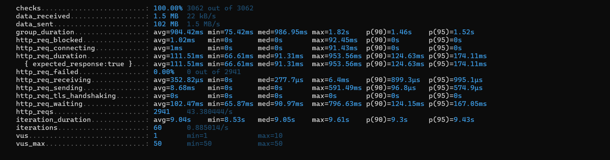

## Install K6 on Windows
Follow steps mentioned on https://grafana.com/docs/k6/latest/set-up/install-k6/#windows

## Run any scenario

```commandline
k6 run --env scenario=<Scenario_Name> .\script.js
```

## Run All APIs with constant arrival rate of 5 req per VU

```commandline
k6 run --env scenario=AllApis_ConstantRate_5 .\script.js
```

### Expected output
- All tests should pass
- You should see k6 results as following:



## Supported Scenarios

| Type                  | Scenarios                     |
|-----------------------|-------------------------------|
| per-vu-iterations     | listUsers_constant            |
| per-vu-iterations     | OrganizationCRUD_constant     |
| per-vu-iterations     | WorkspaceCRUD_constant        |
| per-vu-iterations     | DatasetCRUD_constant          |
| per-vu-iterations     | SourceCRUD_constant           |
| per-vu-iterations     | DestinationCRUD_constant      |
| per-vu-iterations     | UploadFile_constant           |
| per-vu-iterations     | IngestOneFile_constant        |
| per-vu-iterations     | GetAuditLogs_constant         |
| per-vu-iterations     | WorkflowCRUD_constant         |
| constant-arrival-rate | DatasetCRUD_ConstantRate_5    |
| constant-arrival-rate | IngestOneFile_ConstantRate_5  |
| constant-arrival-rate | IngestOneFile_ConstantRate_10 |
| constant-arrival-rate | AllApis_ConstantRate_1        |
| constant-arrival-rate | AllApis_ConstantRate_5        |
|                       |                               |

